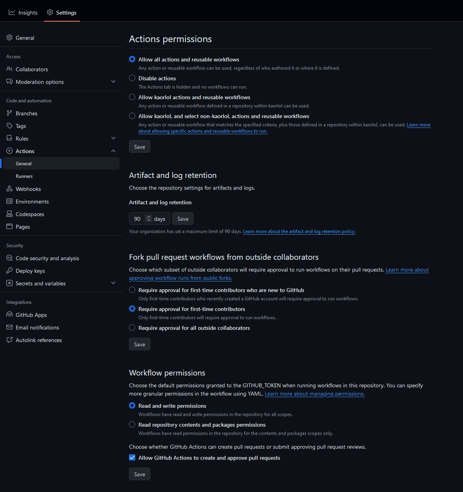

# Obtainium Artifact Downloader
This is a simple script that downloads any files from a github action extracts the apks from them and uploads them to your github releases.

## Usage
- Create a new github repository by clicking on the following [template](https://github.com/new?template_name=apk-artifact-downloader&template_owner=kaorlol).
- Go to the `settings.json` file located in the `data` folder and change following settings to the settings of the repository you wanna download the apks from.
- Go to your repository's settings and go to the `actions` tab and go down to `Workflow permissions` and make sure `Read and write permissions` is enabled.

- After you've made the new repository to the github repository and click on the `Actions` tab.
- Click on the workflow named `update-checker` in the left sidebar.
- After clicking on it you should see a blue banner pop-up saying: `This workflow has a workflow_dispatch event trigger`.
Click on the button to the right called `Run workflow` then click the green button.

## Issues
If you encounter any issues with the workflow or the checker itself create a new issue [here](https://github.com/kaorlol/apk-artifact-downloader/issues)

### Note:
If you see anything in the releases of this repository ignore it. Its just uploaded there because of a test that was run. 
